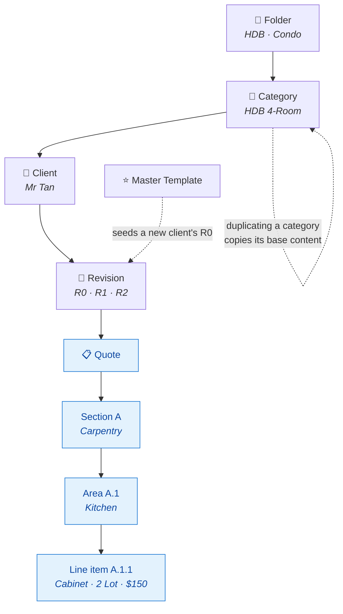
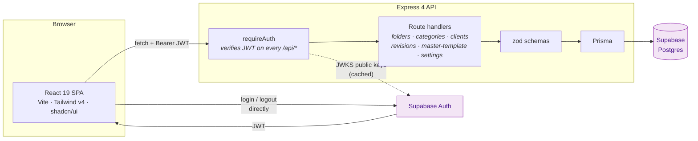
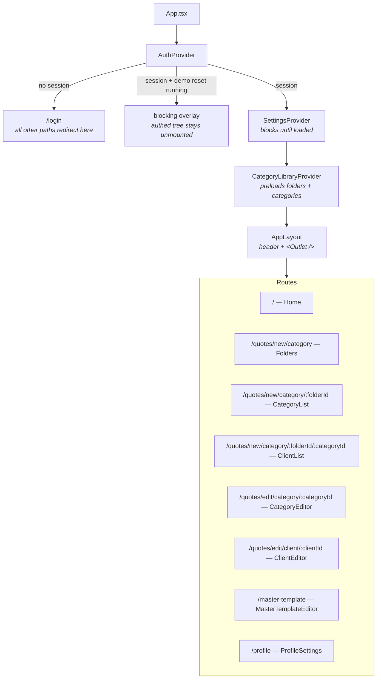
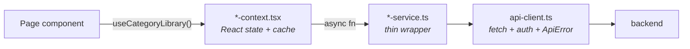
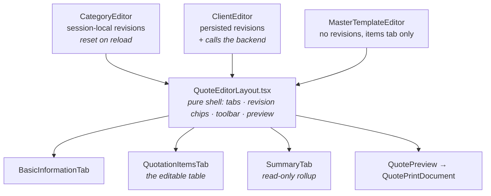
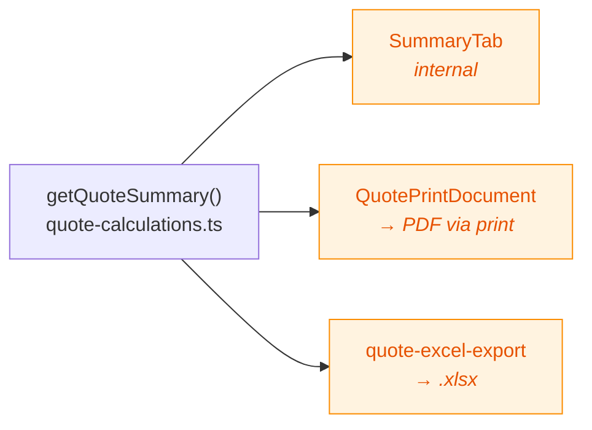
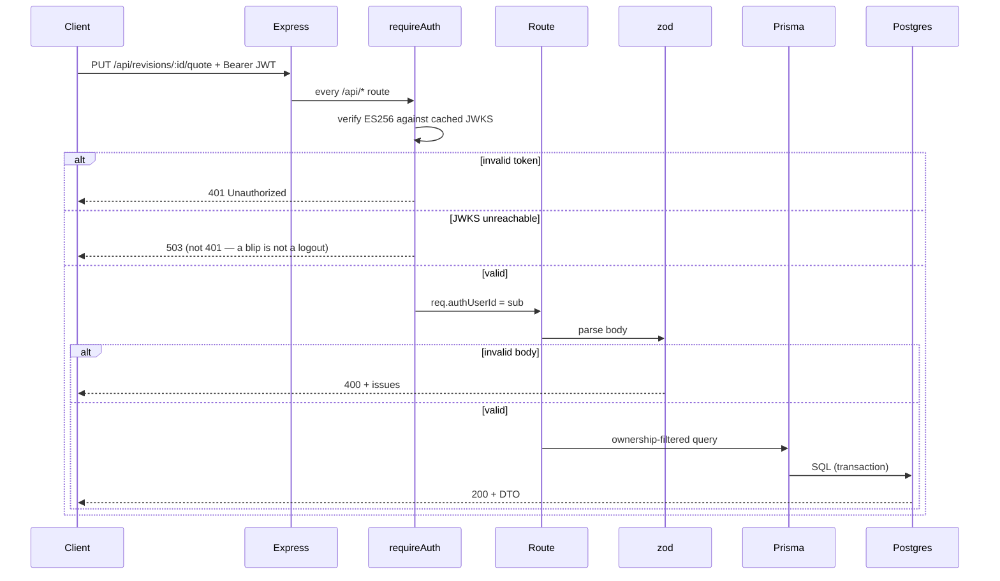
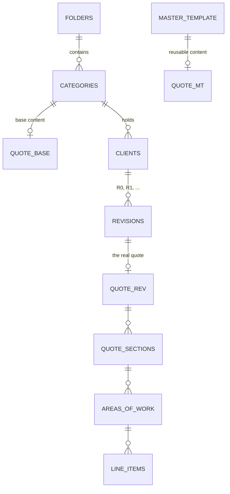
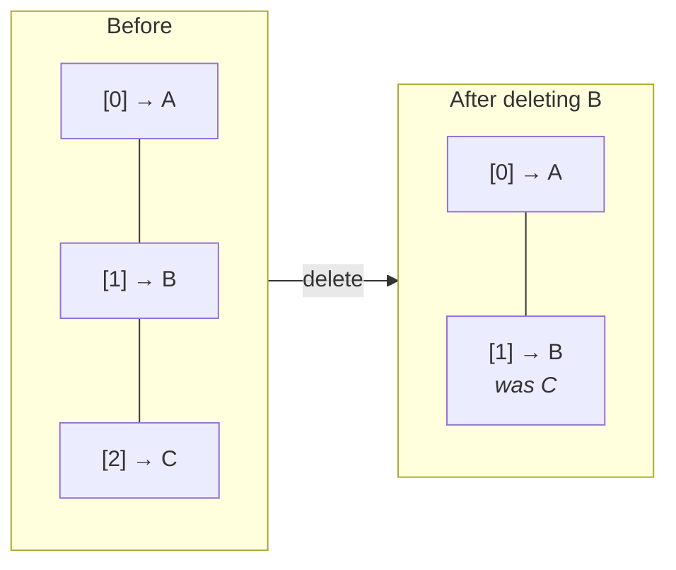

# Architecture

How the QMC frontend and backend fit together, for someone reading this codebase for the first time.

**In one sentence:** a React SPA edits nested quote documents, saves them wholesale to an Express API, which validates them with zod and stores them as a four-level tree in Postgres via Prisma.

- [The domain in one picture](#the-domain-in-one-picture)
- [System overview](#system-overview)
- [Frontend](#frontend)
- [Backend](#backend)
- [Two rules that explain most of the code](#two-rules-that-explain-most-of-the-code)
- [Auth](#auth)
- [Where to make common changes](#where-to-make-common-changes)

Related: [README](../README.md) for setup and full API reference · [testing.md](testing.md) for the test suite.

---

## The domain in one picture

Everything in this app exists to produce **one document**: a quotation. Understand the shape of that document and the rest follows.



The four-level quote tree — **Quote → Section → Area of Work → Line Item** — is the heart of the system. It is the same shape in the database, in the API payloads, and in React state. That deliberate sameness is why a quote can be cloned, saved, and re-read without translation layers fighting each other.

A **line item** is where the money lives:

| Field | Meaning |
| --- | --- |
| `qty` × `selling` | what the client pays for this row |
| `cost` | what the business pays — internal only, never printed |
| `foc` | free of charge: zeroes the price, **keeps** the cost (tracked as a loss) |
| `inc` | included: unticking zeroes both price and cost |

**Revisions are immutable history.** `R0`, `R1`, `R2` are real persisted rows, not undo states. Only the latest is editable; older ones are the record of what was quoted before.

---

## System overview



The frontend talks to Supabase for **authentication only** — it never uses Supabase as a database client. All data flows through the Express API.

**Stack, briefly:**

| Layer | Choice | Note |
| --- | --- | --- |
| Frontend | Vite + React 19 + TypeScript | |
| Styling | Tailwind CSS v4 + DaisyUI + shadcn/ui | CSS-first config, no `tailwind.config.js` |
| Routing | react-router-dom | |
| Backend | Express 4 + TypeScript | ESM with `NodeNext` — **relative imports need `.js` extensions even in `.ts` source** |
| ORM | Prisma | pooled `DATABASE_URL` for the app, direct `DIRECT_URL` for migrations |
| Validation | zod | |
| Auth | Supabase Auth, ES256 asymmetric | verified server-side with `jose` |
| Export | `xlsx` (Excel), `window.print()` (PDF) | |

---

## Frontend

### Layout and routing



The provider nesting order matters: auth gates everything, settings must finish loading before any page renders (pages read `gstRate` and `currencySymbol` from it), and the category library preloads folder/category data needed for breadcrumbs everywhere.

Two things about the signed-out branch are deliberate. Signed-out visitors are **redirected to `/login`** rather than shown the form at their current URL, so signing in always lands on the dashboard instead of resuming a deep route that may no longer exist. And the demo playground's reset — which needs a session to authenticate, but where the session going live is also what mounts the authed tree — raises a `demoResetting` flag in `AuthProvider` that renders a blocking overlay *instead of* the authed routes, so no preload or autosave can hit rows the reset is midway through deleting.

### Data layer — the one pattern to know

Server data **always** flows through a service → context → page chain. Pages never call `fetch` directly.



| Service | Context? | Why |
| --- | --- | --- |
| `category-library-service` | ✅ `useCategoryLibrary()` | Folders/categories are needed app-wide for breadcrumbs — preloaded once on mount. |
| `settings-service` | ✅ `useSettings()` | GST rate, currency, payment terms — read by nearly every money view. |
| `client-service`, `revision-service` | ❌ | Naturally scoped to one screen; pages fetch them with local `useState`/`useEffect`. |
| `master-template-service` | ❌ | Only `MasterTemplateEditor` uses it. |

`api-client.ts` throws `ApiError` (carrying `.status`) on any non-2xx, so callers can branch on `404` without string-matching.

**When adding new server data, extend a service and its context — do not bypass them.** The one sanctioned exception is UI preference state (panel collapse), which uses `useLocalStorageState` because it is not server-owned.

### The Quote Editor

Three route components share one presentational shell:



The key difference: **`CategoryEditor`'s revisions are a drafting convenience that vanish on reload; `ClientEditor`'s are real database rows.** Only `ClientEditor` persists a revision when you click `+`.

Edits autosave on a **500ms debounce**, and saves replace the whole `sections` tree rather than diffing — simple and correct for a low-frequency autosave. Because the debounce effect keys off the quote's state, it must be gated on a **dirty flag** set only by the change handlers; otherwise it also fires on first load and on every revision-chip switch, rewriting the entire tree server-side for content nobody edited.

`ClientEditor` has one subtlety worth knowing: client name/email/contact are stored per-revision on the quote, but are **overwritten from the live `Client` record** every time a revision loads, so old revisions never show stale contact details. On the latest revision those fields are editable and write to both places.

### Output paths share a column contract

Three renderers must agree, or a client sees different numbers in different formats:



All three render `No. · Description · Qty · Unit · Unit Price · Amount`, with **currency in the header** (`Amount (S$)`) and bare numbers in cells — so Excel amounts stay numeric and sortable.

`SummaryTab` additionally shows `Cost Price`, `Seller Price`, and `Profit/Loss (%)` plus total metric boxes. **That extra information is internal and must never appear in the print or Excel output.**

> ⚠️ Change one of the three, change all three. Only the Excel side is protected by tests today.

---

## Backend

### Request lifecycle



`index.ts` wires this up: CORS → JSON parsing → `requireAuth` on `/api` → routers → 404 → a `ZodError`-aware error handler. Handlers are wrapped in `asyncHandler` because **Express 4 does not catch async rejections on its own**.

### Modules

| File | Responsibility |
| --- | --- |
| `index.ts` | App assembly, middleware order, error handling |
| `require-auth.ts` | JWT verification; sets `req.authUserId`. Returns **503** when verification is unavailable, 401 only for genuinely bad tokens |
| `db.ts` | Prisma singleton |
| `schemas.ts` | zod request-body contracts |
| `quote-mapper.ts` | Prisma rows → `QuoteDTO` (ordering, `Decimal`→`number`, `BLANK_QUOTE` fallback) |
| `clone-quote.ts` | `QuoteDTO` → Prisma nested-create input (the reverse) |
| `routes/*.ts` | One file per resource; names map 1:1 to frontend service functions |

`quote-mapper` and `clone-quote` are inverses, and their round-trip losslessness is pinned by a test — see [testing.md](testing.md#backend-quote-mappertestts--6-tests).

### Database schema



One `Quote` table serves all three owners via three nullable unique FKs (`categoryId`, `revisionId`, `masterTemplateId`). **Application code guarantees exactly one is set — the database does not enforce it.**

Every parent→child relation cascades on delete. `company_settings` and `quote_config` are single-row global config.

---

## Two rules that explain most of the code

### 1. Numbering is derived, never stored

"Section A", "A.1", "A.1.1" are computed from **array position** at render time. `QuoteSection.name` is a placeholder that is never displayed.



Deleting a section reflows the rest immediately instead of leaving a permanent gap. The trade-off: numbering is never a stable identifier, so never key anything off it — use `id`.

`position` columns in the database exist to preserve **order**, which is why every read sorts by `position` rather than trusting row order.

### 2. Three-tier gating on totals

A line item counts toward any total only if all three gates are open:

```
Section.complete ✓  →  Area.included ✓  →  Item.inc ✓  →  counts
```

Plus the FOC asymmetry: `foc` zeroes the **price** but keeps the **cost**, because a freebie is a real expense the business should see as a loss. `inc: false` zeroes both.

This rule lives in `quote-calculations.ts` and is enforced by 27 tests — it is the most heavily tested logic in the codebase, because it decides every number a client sees.

---

## Auth

Two Supabase Auth users exist per project (**kim hoe**, the real user, and **admin**, a dev sandbox), plus a **demo playground account** on the shared main/testing project. There is no role system — both users have identical permissions.

Isolation comes from **per-user data ownership**, not authorization tiers:

- `Folder.ownerId` and `MasterTemplate.ownerId` hold the Supabase auth UID
- Everything nested below (categories → clients → revisions → quote) has **no `ownerId` of its own**
- Ownership is enforced per request with Prisma relation filters: `where: { folder: { ownerId: req.authUserId } }`

There is no local `users` table at all — Supabase's `auth.users` is the only one. Display name and email come straight from the session via `useCurrentUser()`.

### The token race, and why it matters

The frontend attaches its bearer token by **awaiting** `supabase.auth.getSession()`. It previously read a module-level variable populated by an async `onAuthStateChange` listener — which meant requests firing during app mount (notably the folder preload) went out with **no `Authorization` header** and got a 401. Users saw an empty folder list until they refreshed.

Two defenses now exist, and both matter:

1. **The race is gone structurally** — `getAccessToken()` awaits the session. Do not "optimize" this back into a synchronous cache.
2. **A failed load can never look like an empty state** — `CategoryLibraryProvider` catches errors, always clears `loading`, and exposes `error` + `reload()`; pages render `LoadErrorState` with a Retry button.

Rule 2 is the durable one: any future network failure now surfaces as an error, not as a convincing "you have no data".

---

## Where to make common changes

| Task | Start here |
| --- | --- |
| Change money math | `frontend/src/lib/quote-calculations.ts` + its test |
| Change output columns | `SummaryTab.tsx`, `QuotePrintDocument.tsx`, `quote-excel-export.ts` — **all three** |
| Add an API endpoint | `backend/src/routes/*.ts` → `schemas.ts` → matching `frontend/src/lib/*-service.ts` |
| Add server-owned data to the UI | Extend a service **and** its context; never fetch from a page |
| Change the quote tree shape | `schema.prisma` → migrate → `types.ts` → `quote-mapper.ts` → `clone-quote.ts` → frontend `mock-data.ts` types |
| Adjust auth or ownership | `require-auth.ts` + the Prisma relation filters in each route |
| Bump the displayed version | `frontend/package.json` `version` only — injected as `__APP_VERSION__` |

**Before any change lands:** `npm test` and `npm run build` in the affected workspace. The build is the source of truth for "does it compile" — see [testing.md](testing.md).
