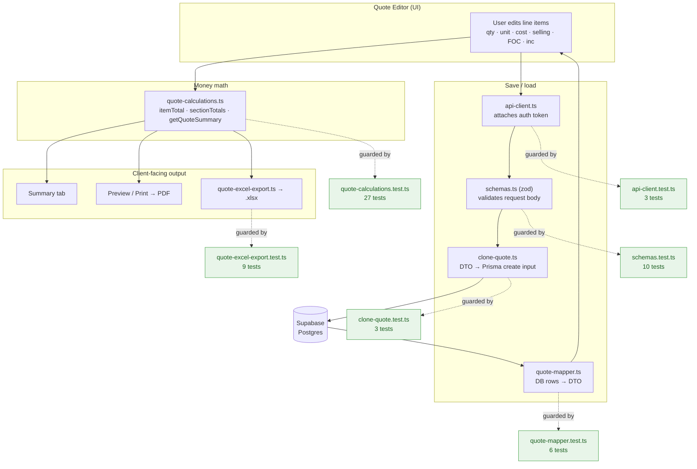
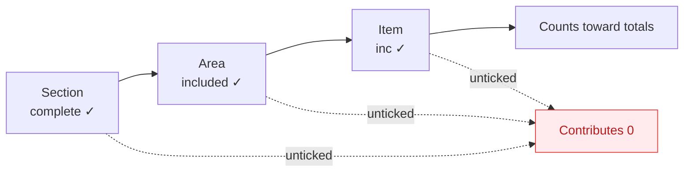
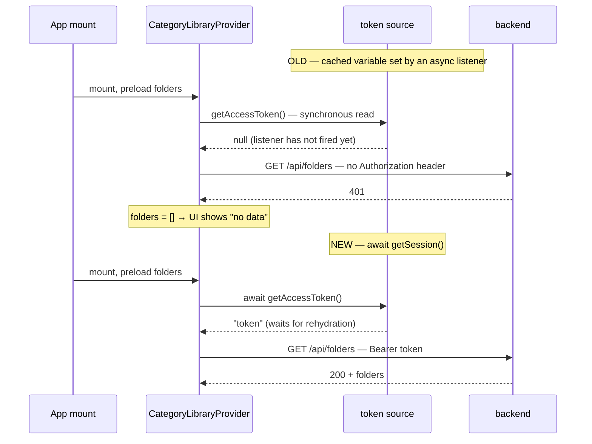
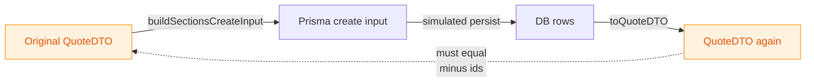
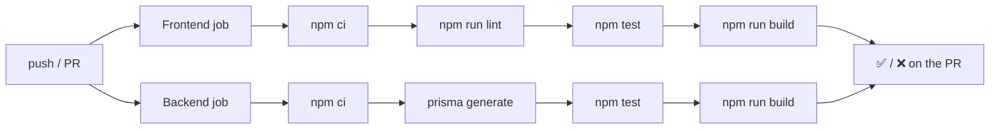

# Testing

Complete reference for the QMC test suite — every test, what it protects, how it looks when it passes or fails, and how critical each one is.

**Current state: 138 tests across 14 files.** Frontend 62, backend 76. Every test is a pure function test: no database, no network, no environment variables, no browser. The whole suite runs in well under a second.

---

## Contents

- [Quick start](#quick-start)
- [How the suite is organised](#how-the-suite-is-organised)
- [What the tests actually protect](#what-the-tests-actually-protect)
- [Reading test output](#reading-test-output)
- [Criticality ratings](#criticality-ratings)
- [The full test catalogue](#the-full-test-catalogue)
  - [Frontend: quote-calculations.test.ts (27)](#frontend-quote-calculationstestts--27-tests)
  - [Frontend: quote-excel-export.test.ts (9)](#frontend-quote-excel-exporttestts--9-tests)
  - [Frontend: api-client.test.ts (3)](#frontend-api-clienttestts--3-tests)
  - [Frontend: utils.test.ts (8)](#frontend-utilstestts--8-tests)
  - [Backend: quote-mapper.test.ts (6)](#backend-quote-mappertestts--6-tests)
  - [Backend: clone-quote.test.ts (3)](#backend-clone-quotetestts--3-tests)
  - [Backend: schemas.test.ts (10)](#backend-schemastestts--10-tests)
  - [Revision documents (3 files)](#revision-documents)
- [Manual checks: revision documents](#manual-checks-revision-documents)
- [Coverage map and gaps](#coverage-map-and-gaps)
- [Conventions](#conventions)
- [CI](#ci)
- [Adding a test](#adding-a-test)

---

## Quick start

Run from `frontend/` or `backend/` — each workspace has its own suite.

| Command | What it does |
| --- | --- |
| `npm test` | Run that workspace's suite once. This is exactly what CI runs. |
| `npm run test:watch` | Watch mode — reruns affected tests on save. Use while writing code. |
| `npx vitest run src/lib/quote-calculations.test.ts` | Run one file. |
| `npx vitest run -t "FOC"` | Run only tests whose name matches a string. |
| `npx vitest run --reporter=verbose` | Print every test name, not just a per-file summary. |

To run **both** suites, run the command twice — there is no root-level runner:

```bash
cd frontend && npm test && cd ../backend && npm test
```

> **Note:** `cd` persists within a single shell invocation. If you run the frontend suite and then `npm test` again without changing directory, you will silently run the frontend suite twice. Check the header line Vitest prints — it names the workspace root.

---

## How the suite is organised

```
QMC/
├── frontend/
│   └── src/
│       ├── lib/
│       │   ├── quote-calculations.ts      ← module
│       │   ├── quote-calculations.test.ts ← its test, colocated
│       │   ├── quote-excel-export.ts
│       │   ├── quote-excel-export.test.ts
│       │   ├── api-client.ts
│       │   ├── api-client.test.ts
│       │   ├── utils.ts
│       │   └── utils.test.ts
│       └── test-utils/
│           └── quote-builders.ts          ← makeItem / makeArea / makeSection / makeQuote
└── backend/
    └── src/
        ├── quote-mapper.ts
        ├── quote-mapper.test.ts
        ├── clone-quote.ts
        ├── clone-quote.test.ts
        ├── schemas.ts
        ├── schemas.test.ts
        └── test-utils/
            └── quote-builders.ts          ← makeItemDTO / makeAreaDTO / makeSectionDTO / makeQuoteDTO
```

Tests sit next to the module they test. Vitest picks up `src/**/*.test.ts`; the TypeScript builds exclude them (backend via `tsconfig.json` `exclude`, frontend is `noEmit` anyway), so test files never ship.

---

## What the tests actually protect

The suite is deliberately concentrated on the paths where a silent bug costs real money or real trust. This diagram shows a quote's journey through the system and which test file guards each hop:



Two failure modes drive almost every test in this suite:

1. **A wrong number reaches a client.** A quote that under-charges loses money on the job; one that over-charges loses the job. The money math and the export layout carry the most tests for this reason.
2. **Saved work is silently corrupted or lost.** A quote that round-trips through the database with a reordered section or a dropped flag is worse than one that fails loudly, because nobody notices until the client does.

---

## Reading test output

### When everything passes

```
 RUN  v3.2.7 /Users/you/QMC/frontend

 ✓ src/lib/api-client.test.ts (3 tests) 14ms
 ✓ src/lib/utils.test.ts (8 tests) 6ms
 ✓ src/lib/quote-calculations.test.ts (27 tests) 18ms
 ✓ src/lib/quote-excel-export.test.ts (9 tests) 4ms

 Test Files  4 passed (4)
      Tests  47 passed (47)
   Duration  383ms
```

Green `✓`, `Test Files  N passed`, and **exit code 0**. CI goes green on this.

With `--reporter=verbose` you get one line per test instead:

```
 ✓ src/lib/quote-calculations.test.ts > itemTotal > returns qty × selling for an included, non-FOC item 1ms
 ✓ src/lib/quote-calculations.test.ts > sectionTotals > FOC item counts toward cost but NOT price (tracked as a loss) 0ms
```

The `>` separators are the `describe` → `it` nesting, which is why test names are written to read as a sentence.

### When something fails

Vitest prints the file, the full test path, a diff, and the exact source line. A real example — this is the output produced by reverting the `await` in `api-client.ts`, the bug fixed in `154b998`:

```
 FAIL  src/lib/api-client.test.ts > api-client auth header > waits for an access token that resolves asynchronously

AssertionError: expected 'Bearer [object Promise]' to be 'Bearer late-token'

- Expected
+ Received

- Bearer late-token
+ Bearer [object Promise]

 ❯ src/lib/api-client.test.ts:48:52
     46|     await api.get('/api/folders')
     47|
     48|     expect(lastRequestHeaders(fetchMock).Authorization).toBe('Bearer late-token')
       |                                                    ^

 Test Files  1 failed (1)
      Tests  2 failed | 1 passed (3)
```

How to read it, in order:

| Part | Meaning |
| --- | --- |
| `FAIL <file> > <describe> > <it>` | Which test. The `it` text states the business rule that broke. |
| `AssertionError: expected X to be Y` | The one-line summary. |
| `- Expected` / `+ Received` | `-` is what the test wanted, `+` is what the code produced. |
| `❯ file:line:col` + source excerpt | The exact failing assertion, with `^` under the call. |
| Final tally | `Tests  2 failed \| 1 passed` — note failures do **not** stop the run. |

**Exit code is 1 on any failure**, which is what makes CI red and blocks the merge.

### Floating-point failures look different

Money math uses `toBeCloseTo`, so a precision failure reports a *precision* rather than a value:

```
AssertionError: expected 545.0000000000001 to be close to 545, received difference is 1.1e-13, but expected 1e-10
```

If you see this, the fix is almost never to loosen the precision — it is usually a genuine ordering change in how the sum accumulates.

---

## Criticality ratings

Every test below is tagged. The rating answers: **if this test fails, how bad is it?**

| Rating | Meaning | If it fails |
| --- | --- | --- |
| 🔴 **High** | A client-visible money error, or silent data loss. | Stop. Do not deploy. Do not "fix" by changing the test — confirm the business rule first. |
| 🟠 **Medium** | Wrong structure, wrong ordering, or a broken contract between layers. Output is wrong but usually visibly so. | Fix before merging. Check whether sibling output paths (Summary / Print / Excel) drifted too. |
| 🟡 **Low** | Formatting, cosmetics, or a deliberately pinned known gap. | Fix at leisure. A `KNOWN GAP` failure may mean someone *improved* the code — see below. |

Distribution across the 66 tests: **28 High · 24 Medium · 14 Low**.

---

## The full test catalogue

### Frontend: `quote-calculations.test.ts` — 27 tests

📁 [`frontend/src/lib/quote-calculations.test.ts`](../frontend/src/lib/quote-calculations.test.ts) — tests [`quote-calculations.ts`](../frontend/src/lib/quote-calculations.ts)

The single most important file in the suite. Every number a client ever sees originates here.

**Background — the three-tier gate.** For a line item to count toward any total, all three checkboxes must be ticked, outermost first:



Plus one asymmetry that trips up every newcomer: **`foc` (free of charge) zeroes the price but keeps the cost.** That is deliberate — a freebie still costs the business money, and the whole point of tracking it is to see it as a loss.

#### `itemTotal` — 6 tests

| # | Test | Rule | Example | Rating |
| --- | --- | --- | --- | --- |
| 1 | returns qty × selling for an included, non-FOC item | Base case | `qty 3 × selling 150` → `450` | 🔴 High |
| 2 | returns 0 for an FOC item | FOC means no price contribution | `foc: true, qty 3, selling 150` → `0` | 🔴 High |
| 3 | returns 0 for an unchecked item (`inc = false`) | Item-level gate | `inc: false, qty 3, selling 150` → `0` | 🔴 High |
| 4 | returns 0 when both FOC and unchecked | Flags compose, no double-negative bug | `foc: true, inc: false` → `0` | 🟠 Medium |
| 5 | handles zero quantity | Degenerate input | `qty 0` → `0` | 🟡 Low |
| 6 | handles fractional quantities | Real quotes use `2.5 SqFt` | `qty 2.5 × selling 100` → `250` | 🟠 Medium |

```ts
// Test 2 — the FOC rule, stated as the test name states it.
expect(itemTotal(makeItem({ foc: true, qty: 3, selling: 150 }))).toBe(0)
```

> **Why 1–3 are High:** these are the arithmetic that produces the Grand Total on the PDF a client signs. A regression here is a wrong invoice.

#### `itemProfitPercent` — 3 tests

| # | Test | Rule | Example | Rating |
| --- | --- | --- | --- | --- |
| 7 | computes margin over cost | Margin is over **cost**, not over selling | `cost 100, selling 150` → `50` (%) | 🟠 Medium |
| 8 | returns 0 when cost is 0 | No division by zero | `cost 0, selling 150` → `0` | 🟠 Medium |
| 9 | goes negative when selling below cost | Losses must show as negative | `cost 200, selling 150` → `-25` | 🟠 Medium |

Medium rather than High because this figure is **internal only** — it appears in the Summary tab, never on client-facing output. A wrong margin misleads staff; it does not misquote a customer.

#### `includedAreas` — 2 tests

| # | Test | Rule | Example | Rating |
| --- | --- | --- | --- | --- |
| 10 | keeps only areas whose `included` box is ticked | Middle gate | `[a1 ✓, a2 ✗, a3 ✓]` → `[a1, a3]` | 🔴 High |
| 11 | returns empty list for a section with no areas | Degenerate input | `areas: []` → `[]` | 🟡 Low |

#### `sectionTotals` — 4 tests

| # | Test | Rule | Example | Rating |
| --- | --- | --- | --- | --- |
| 12 | sums price, cost, profit across included areas | Aggregation | 2×(100→150) + 1×(50→80) → `{price 380, cost 250, profit 130}` | 🔴 High |
| 13 | **FOC counts toward cost but NOT price** | The asymmetry, tracked as a loss | `foc, cost 100, selling 150` → `{price 0, cost 100, profit -100}` | 🔴 High |
| 14 | unchecked item counts toward neither | `inc:false` zeroes cost too | → `{price 0, cost 0, profit 0}` | 🔴 High |
| 15 | ignores items in non-included areas entirely | Area gate beats item content | `included:false` with `qty 10` → all zeros | 🔴 High |

```ts
// Test 13 — note profit goes negative. This is the FOC rule's whole point.
expect(sectionTotals(section)).toEqual({ price: 0, cost: 100, profit: -100 })
```

> **Test 13 vs 14 is the subtle pair.** FOC keeps cost; `inc:false` drops cost. Both zero the price. If someone "simplifies" these into one branch, 13 or 14 fails — which is exactly what should happen.

#### `getQuoteSummary` — 7 tests

The quote-wide rollup feeding Summary, Preview, PDF, and Excel.

| # | Test | Rule | Example | Rating |
| --- | --- | --- | --- | --- |
| 16 | excludes sections not marked complete | Outermost gate | `complete:false` with `selling 999` → `subTotal 0` | 🔴 High |
| 17 | excludes complete sections whose areas are all un-included | Empty section drops out | → `sections: []` | 🔴 High |
| 18 | includes a complete section with ≥1 included area, stripping the rest | Partial inclusion | `[a1 ✓, a2 ✗]` → summary holds only `a1` | 🔴 High |
| 19 | computes subTotal, GST, grand total | GST at 9% | `500` → GST `45`, grand `545` | 🔴 High |
| 20 | all three gates together | Integration of 16–18 | 4 sections → only `s1`+`s4` survive, `subTotal 100` | 🔴 High |
| 21 | returns zeros for an empty quote | Degenerate input | → `{sections:[], subTotal:0, gst:0, grandTotal:0}` | 🟠 Medium |
| 22 | survives floating-point math | IEEE-754 reality | `qty 0.1 × selling 0.2` → `0.02`, grand `0.0218` | 🟠 Medium |

```ts
// Test 20 — the whole gating system in one assertion.
// s1 counted · s2 section incomplete · s3 area excluded · s4 item unchecked
expect(summary.sections.map((e) => e.section.id)).toEqual(['s1', 's4'])
expect(summary.subTotal).toBe(100)
```

Note `s4` **appears** in the summary (its section and area are ticked) but contributes `0`. Section headers still print even when every item inside is unchecked — deliberate, so the printed quote keeps its structure.

#### `formatMoney` — 5 tests

| # | Test | Rule | Example | Rating |
| --- | --- | --- | --- | --- |
| 23 | thousands grouping, exactly 2 decimals | Display format | `1234.5` → `S$1,234.50` | 🟠 Medium |
| 24 | pads whole numbers to 2 decimals | No bare `S$1000000` | → `S$1,000,000.00` | 🟡 Low |
| 25 | symbol stays in front of negatives | Loss display | `-100` → `S$-100.00` | 🟡 Low |
| 26 | uses the caller's currency symbol | No hardcoded `S$` | `formatMoney(50, '$')` → `$50.00` | 🟠 Medium |
| 27 | rounds rather than truncates | Half-up at 2dp | `0.005` → `S$0.01`; `1.239` → `S$1.24` | 🟠 Medium |

---

### Frontend: `quote-excel-export.test.ts` — 9 tests

📁 [`frontend/src/lib/quote-excel-export.test.ts`](../frontend/src/lib/quote-excel-export.test.ts) — tests [`quote-excel-export.ts`](../frontend/src/lib/quote-excel-export.ts)

Tests the **pure** `buildExcelRows()` (array-of-arrays layout). The impure `XLSX.writeFile` download wrapper is never called, which is why no filesystem or browser is needed.

These tests pin the **column contract** shared by Summary, Print, and Excel:

```
 col:    0        1              2      3       4                   5
       ┌────────┬──────────────┬──────┬───────┬───────────────────┬────────────────┐
       │ No.    │ Description  │ Qty  │ Unit  │ Unit Price (S$)   │ Amount (S$)    │
       ├────────┼──────────────┼──────┼───────┼───────────────────┼────────────────┤
       │ A.     │ Carpentry    │      │       │                   │                │  ← section
       │ A.1    │ Kitchen      │      │       │                   │                │  ← area
       │ A.1.1  │ Cabinet      │ 2    │ Lot   │ 150               │ 300            │  ← item
       │ A.1.2  │ Freebie      │ 1    │ Lot   │ 50                │ FOC            │  ← FOC item
       ├────────┴──────────────┴──────┴───────┼───────────────────┼────────────────┤
       │                                      │ Sub Total         │ 1000           │
       │                                      │ GST 9%            │ 90             │
       │                                      │ Grand Total       │ 1090           │
       └──────────────────────────────────────┴───────────────────┴────────────────┘
```

Currency lives in the **header**; cells hold bare numbers so Excel keeps them numeric and sortable. Total rows pad with four empty strings so the label lands in column 4 and the value in column 5 — that padding is exactly what tests 35–36 pin.

| # | Test | Rule | Example | Rating |
| --- | --- | --- | --- | --- |
| 28 | `toLetter` maps indices to spreadsheet letters | Section lettering, incl. rollover | `0→A`, `25→Z`, `26→AA`, `27→AB` | 🟠 Medium |
| 29 | starts with company / client / REF header rows | Document identity | row0 `['Kimchinc Pte Ltd']`, row1 client+revision, row2 REF+date | 🟠 Medium |
| 30 | numbers sections A/B, areas A.1, items A.1.1 from position | Derived numbering, never stored | `A.1`→`Kitchen`, `A.1.1`→`Cabinet`, `B.1`→`Bedroom` | 🔴 High |
| 31 | header row uses the 6-column set with currency in header | The column contract | `['No.','Description','Qty','Unit','Unit Price (S$)','Amount (S$)']` | 🔴 High |
| 32 | renders literal `FOC`, not `0`, in Amount | FOC visibility | Unit Price `50`, Amount `'FOC'` | 🔴 High |
| 33 | renders normal amounts as numbers | Stay numeric, not strings | `qty 2 × 150` → Unit Price `150`, Amount `300` | 🔴 High |
| 34 | placeholder row when nothing is included | Empty state | `['No items included yet.']` | 🟡 Low |
| 35 | appends Sub Total / GST / Grand Total | Totals block + padding | `['','','','','Sub Total',1000]`, GST `90`, grand `1090` | 🔴 High |
| 36 | payment terms = grandTotal × percent, numeric, 2dp | Deposit schedule | `1090` split 50/50 → `[1,'Deposit',545]`, `[2,'Completion',545]` | 🔴 High |

```ts
// Test 32 — FOC shows its unit price but "FOC" as the amount.
expect(itemRow?.[4]).toBe(50)      // Unit Price — still a number
expect(itemRow?.[5]).toBe('FOC')   // Amount — literal text
```

> ⚠️ **Change one output, change all three.** Summary, `QuotePrintDocument`, and Excel share this column contract. Tests 31/35 pin the count and offsets on the Excel side only — the other two have no tests yet (see [gaps](#coverage-map-and-gaps)), so if you edit columns, check them by eye.

---

### Frontend: `api-client.test.ts` — 3 tests

📁 [`frontend/src/lib/api-client.test.ts`](../frontend/src/lib/api-client.test.ts) — tests [`api-client.ts`](../frontend/src/lib/api-client.ts)

**Regression tests for a shipped production bug** (commit `154b998`). Users intermittently opened "Generate Quote" and saw *no folders*, or opened a folder and saw *no categories*, until they refreshed once or several times.

The cause was a race:



| # | Test | Rule | Example | Rating |
| --- | --- | --- | --- | --- |
| 37 | waits for an access token that resolves asynchronously | The race fix | token resolving after 10ms still lands as `Bearer late-token` | 🔴 High |
| 38 | omits Authorization when there is genuinely no session | Don't send `Bearer null` | `getAccessToken → null` → no header | 🟠 Medium |
| 39 | throws `ApiError` carrying `.status` on non-2xx | Callers branch on `.status` (e.g. 404 → undefined) | 401 → `ApiError{status:401, message:'Unauthorized'}` | 🟠 Medium |

```ts
// Test 37 — a token that resolves on a later tick must still reach the request.
getAccessToken.mockImplementation(
  () => new Promise<string>((resolve) => setTimeout(() => resolve('late-token'), 10)),
)
await api.get('/api/folders')
expect(lastRequestHeaders(fetchMock).Authorization).toBe('Bearer late-token')
```

> **Verified to catch the real bug.** Reverting `await getAccessToken()` to a synchronous read makes 2 of these 3 fail, sending the literal string `Bearer [object Promise]`. A regression test that has never been seen failing is only a guess; this one has been checked.

---

### Frontend: `utils.test.ts` — 8 tests

📁 [`frontend/src/lib/utils.test.ts`](../frontend/src/lib/utils.test.ts) — tests [`utils.ts`](../frontend/src/lib/utils.ts)

| # | Test | Rule | Example | Rating |
| --- | --- | --- | --- | --- |
| 40 | title-cases each space-separated word | Client name display | `'kim hoe'` → `'Kim Hoe'` | 🟡 Low |
| 41 | leaves already-capitalized words unchanged | Idempotent | `'Kim Hoe'` → `'Kim Hoe'` | 🟡 Low |
| 42 | only uppercases the first letter, preserving the rest | No lowercasing the tail | `'mcDonald'` → `'McDonald'` | 🟡 Low |
| 43 | returns an empty string unchanged | Degenerate input | `''` → `''` | 🟡 Low |
| 44 | preserves consecutive spaces | No accidental collapsing | `'kim  hoe'` → `'Kim  Hoe'` | 🟡 Low |
| 45 | `cn` joins class names | Base case | `cn('a','b')` → `'a b'` | 🟡 Low |
| 46 | `cn` drops falsy conditionals | `cond && 'cls'` idiom | `cn('a', false && 'b', undefined, 'c')` → `'a c'` | 🟠 Medium |
| 47 | `cn` resolves Tailwind conflicts, later wins | tailwind-merge behaviour | `cn('p-2','p-4')` → `'p-4'` | 🟠 Medium |

Mostly Low: these are cosmetic helpers, and a failure is visible the moment anyone looks at the screen. Tests 46–47 are Medium because `cn` is used in virtually every component — if tailwind-merge silently changed precedence, styling would break app-wide in ways that are hard to trace back.

---

### Backend: `quote-mapper.test.ts` — 6 tests

📁 [`backend/src/quote-mapper.test.ts`](../backend/src/quote-mapper.test.ts) — tests [`quote-mapper.ts`](../backend/src/quote-mapper.ts)

Converts Prisma rows into the `QuoteDTO` the frontend consumes. **Contains the single most valuable test in the suite** (#52).

| # | Test | Rule | Example | Rating |
| --- | --- | --- | --- | --- |
| 48 | maps a persisted row back to the DTO shape | Base case | `toQuoteDTO(row)` deep-equals the DTO | 🔴 High |
| 49 | orders by `position` column, not row order | DB row order is not guaranteed | rows reversed → still `['s1','s2','s3']`, `['a1','a2']`, `['i1','i2','i3']` | 🔴 High |
| 50 | coerces Decimal-like values to plain numbers | Prisma returns `Decimal`, not `number` | `{toString:()=>'2.5'}` → `2.5` | 🔴 High |
| 51 | `BLANK_QUOTE` when a **category** has no quote row | Null-safety | `quote: null` → `BLANK_QUOTE` | 🟠 Medium |
| 51b | `BLANK_QUOTE` when a **revision** has no quote row | Null-safety | `quote: null` → `BLANK_QUOTE` | 🟠 Medium |
| 52 | **round-trip invariant: save → read never mutates content** | The core guarantee | DTO → create input → rows → DTO is lossless (ids aside) | 🔴 High |

**Why #49 is High:** without an `ORDER BY position`, Postgres may return rows in any order. Sections would silently reshuffle — a client's quote reordering itself between saves, with no error anywhere.

**Why #50 is High:** Prisma hands back `Decimal` objects for numeric columns. Skip the coercion and `qty` becomes an object; `2.5 * 100` yields `NaN`, and `NaN` propagates through every total to the PDF.

**Test 52, the round-trip invariant**, deserves its own diagram — it is the one test that guards *every* clone and autosave path at once:



```ts
// Ids legitimately differ after a clone, so compare everything except ids.
expect(stripIds(toQuoteDTO(persisted))).toEqual(stripIds(original))
```

If this round trip is lossless, then category duplication, client creation from the master template, revision cloning, and every debounced autosave are all structurally incapable of corrupting a quote. One test, four paths.

---

### Backend: `clone-quote.test.ts` — 3 tests

📁 [`backend/src/clone-quote.test.ts`](../backend/src/clone-quote.test.ts) — tests [`clone-quote.ts`](../backend/src/clone-quote.ts)

`buildSectionsCreateInput()` turns a DTO into Prisma nested-create input. Used by category duplication, client creation, revision cloning, and master-template autosave.

| # | Test | Rule | Example | Rating |
| --- | --- | --- | --- | --- |
| 53 | empty create input for no sections | Degenerate input | `[]` → `[]` | 🟡 Low |
| 54 | injects `position` from array index at all three levels | Ordering is written on save | sections `[0,1]`, areas `[0,1]`, items `[0,1]` | 🔴 High |
| 55 | copies fields exactly but **never** the DTO ids | Clones get fresh ids | full nested object compared field-by-field | 🔴 High |

**Why #55 is High:** leaking a source id into a clone's create input would make Prisma either collide on a primary key or, worse, silently attach the new quote's rows to the *original* quote. Editing the copy would then mutate the original. The assertion is a full `toEqual` on the nested structure precisely so an accidentally-added `id` field fails loudly.

Test 54 is the write-side counterpart to mapper test 49 (the read side). Together they close the ordering loop: 54 proves position is written correctly, 49 proves it is read back correctly.

---

### Backend: `schemas.test.ts` — 10 tests

📁 [`backend/src/schemas.test.ts`](../backend/src/schemas.test.ts) — tests [`schemas.ts`](../backend/src/schemas.ts)

The zod validation layer — the boundary where untrusted request bodies become trusted data.

| # | Test | Rule | Example | Rating |
| --- | --- | --- | --- | --- |
| 56 | accepts a fully valid quote DTO | Happy path — guards over-tightening | `safeParse(makeQuoteDTO()).success` → `true` | 🟠 Medium |
| 57 | rejects an unknown unit | Unit is a closed enum | `unit: 'Metre'` → rejected | 🟠 Medium |
| 58 | rejects a string qty | No `"2"` sneaking in | `qty: '2'` → rejected | 🔴 High |
| 59 | rejects a missing `foc`/`inc` flag | Flags are required, not optional | item without `foc` → rejected | 🔴 High |
| 60 | 🟡 **KNOWN GAP:** accepts negative qty and cost | Pinned gap — no `.positive()` yet | `qty:-5, cost:-10` → currently `true` | 🟡 Low |
| 61 | 🟡 **KNOWN GAP:** accepts `Infinity` selling | Pinned gap — no `.finite()` yet | `selling: Infinity` → currently `true` | 🟡 Low |
| 62 | requires the quote wrapped in `{ quote }` | Body shape | `{quote: dto}` ✓, bare `dto` ✗ | 🟠 Medium |
| 63 | defaults `source` to `'scratch'` when omitted | Blank-quote default | `{name:'X'}` → `source: 'scratch'` | 🟠 Medium |
| 64 | accepts `'master'` as a source | Seed from master template | `source:'master'` → preserved | 🟠 Medium |
| 65 | rejects an empty name | No unnamed clients | `{name:''}` → rejected | 🟠 Medium |

**Why 58–59 are High:** a string `qty` reaching the database poisons every downstream calculation — `"2" * 150` is `300` in JavaScript, but `"2" + 150` is `"2150"`, and which one you get depends on the operator. A missing `foc` flag defaults to `undefined`, which is falsy, so a free item silently starts charging the client.

#### About the two `KNOWN GAP` tests

These assert that invalid input is **currently accepted**. They are not endorsements — they are pins, so the gap is visible in the suite rather than lurking undocumented.

If you tighten the schema with `.positive()` or `.finite()`, tests 60 and 61 will **fail**. That failure is good news:

```
 FAIL  src/schemas.test.ts > quoteSchema > KNOWN GAP: currently accepts negative qty and cost
AssertionError: expected false to be true
```

**Flip the assertion to `false` and rename the test** (drop the `KNOWN GAP:` prefix) — do not delete it. The rule is now enforced and deserves a permanent test.

### Revision documents

Three files cover the Documents tab. The feature is mostly I/O — Supabase Storage on one side, cascading deletes on the other — so the logic worth testing was deliberately pushed into pure helpers and a `fetch`-shaped seam.

📁 [`backend/src/document-path.test.ts`](../backend/src/document-path.test.ts) — 16 tests over [`document-path.ts`](../backend/src/document-path.ts)

| Rule | Example | Rating |
| --- | --- | --- |
| The storage key never contains the user's filename | `Client Contract (final).pdf` → `{owner}/{rev}/{uuid}.pdf` | 🔴 High |
| The first path segment is exactly the owner id | this is the segment storage RLS compares to `auth.uid()` | 🔴 High |
| Separators, traversal and control characters are stripped from display names | `../../etc/passwd` → `etc passwd` | 🟠 Medium |
| Long names are capped at 200 chars, extension kept | `aaa….skp` → 200 chars still ending `.skp` | 🟡 Low |

📁 [`backend/src/document-storage.test.ts`](../backend/src/document-storage.test.ts) — 10 tests over [`document-storage.ts`](../backend/src/document-storage.ts), with `fetch` stubbed

| Rule | Example | Rating |
| --- | --- | --- |
| A missing service-role key raises `SupabaseStorageUnavailableError`, with no request sent | routes turn this into a 503, not a 500 | 🟠 Medium |
| Signed URLs carry `&download=<name>` | restores the filename **and** forces `Content-Disposition: attachment` | 🔴 High |
| `statObject` returns `null` for a missing object and on a 404 | drives the "upload did not complete" 409 | 🟠 Medium |
| `removeObjects` chunks at 100 and no-ops on `[]` | a 250-key delete makes 3 requests | 🟠 Medium |

📁 [`frontend/src/lib/document-service.test.ts`](../frontend/src/lib/document-service.test.ts) — 6 tests, `fetch` and `XMLHttpRequest` both stubbed

| Rule | Example | Rating |
| --- | --- | --- |
| An oversized file is rejected before any network call | 50 MB + 1 byte → `FileTooLargeError`, `fetch` never called | 🟠 Medium |
| A failed upload deletes the row it reserved | PUT 500 → `DELETE /api/documents/:id` | 🔴 High |
| A failed confirm deletes it too | confirm 409 → same cleanup | 🔴 High |
| A failed cleanup still surfaces the original error | the sweep is the backstop, not the error message | 🟠 Medium |

**Why the cleanup tests are High:** they are what keeps storage and the database from drifting apart. Without them a dropped upload leaves a document row the user can see but never open.

---

## Manual checks: revision documents

Route handlers and the cascade wiring have no automated coverage (see the gaps below), so these are worth walking once after touching anything in this area:

1. Upload a PDF to the latest revision → reload → it lists → **Download** opens it under its original filename.
2. Switch to `R0` → documents still list and download, the drop zone and delete buttons are gone. Then `curl -X POST` the upload route against `R0` with a valid token → expect **403**, not just a hidden button.
3. Add a revision → the new one starts with **no** documents, and the source revision keeps all of its own.
4. Try a 60 MB file → rejected in the browser with a clear message, no request sent.
5. Delete a whole folder that contained documents, then run `npm run storage:gc` in `backend/` → it reports nothing orphaned.
6. Open the admin drill-down on another user's client → documents list and download work; no upload or delete controls anywhere.

---

## Coverage map and gaps

```mermaid
flowchart TB
    subgraph Covered["✅ Covered by tests"]
        direction TB
        C1["Money math — 27"]
        C2["Excel layout — 9"]
        C3["Auth header — 3"]
        C4["DB → DTO mapping — 6"]
        C5["DTO → DB input — 3"]
        C6["Request validation — 10"]
        C7["String/class helpers — 8"]
    end

    subgraph Uncovered["❌ Not covered"]
        direction TB
        U1["React components<br/>SummaryTab · QuotePrintDocument · editors"]
        U2["Express route handlers<br/>ownership scoping · 404s"]
        U3["Context providers<br/>load / error / retry states"]
        U4["require-auth middleware<br/>401 vs 503 branch"]
        U5["Debounced autosave timing"]
        U6["Print CSS / page breaks"]
        U7["Document routes<br/>latest-revision 403 · cascade cleanup"]
    end

    classDef ok fill:#e8f5e9,stroke:#43a047,color:#1b5e20
    classDef no fill:#ffebee,stroke:#e53935,color:#b71c1c
    class C1,C2,C3,C4,C5,C6,C7 ok
    class U1,U2,U3,U4,U5,U6,U7 no
```



**Honest summary of what is *not* protected.** The suite is strong on pure logic and has nothing on integration. Specifically:

- **No component tests.** `SummaryTab` and `QuotePrintDocument` share the column contract with Excel, but only the Excel side is pinned. A column change in the two React tables breaks nothing in CI.
- **No route tests.** Per-user `ownerId` scoping — the only thing separating one user's folders from another's — has zero automated coverage. This is the largest gap by risk.
- **No middleware test** for the 401-vs-503 branch added in `154b998`, though the frontend half of that fix is covered by tests 37–39.
- **No context/provider tests**, so the `error` + `reload()` retry path added alongside the auth fix is verified only by hand.

Highest-value additions, in order: route tests for ownership scoping (needs a disposable Postgres, see below), then component tests for the shared column contract, then a `require-auth` unit test.

---

## Conventions

**Fixture builders.** Use `makeItem` / `makeArea` / `makeSection` / `makeQuote` (frontend) or the `*DTO` variants (backend). Defaults are the happy path — override only the fields the rule under test cares about, so the test body reads as the rule:

```ts
// Reads as: "a section, containing one area, containing one FOC item"
sectionTotals(makeSection({ areas: [makeArea({ items: [makeItem({ foc: true })] })] }))
```

Add a builder default only when most tests need it; a default that only one test wants belongs in that test as an override.

**Name tests after business rules, not implementations.**

```ts
✅ it('FOC item counts toward cost but NOT price (tracked as a loss)')
❌ it('returns correct object')
```

The name is what a failure prints, so it should say what broke in business terms. Add a comment citing the rule's source when it is non-obvious.

**Floating point:** assert money with `toBeCloseTo(value, 10)`, never `toBe`, wherever GST or fractional quantities are involved.

```ts
expect(summary.gst).toBeCloseTo(45, 10)      // ✅ 500 × 0.09
expect(summary.gst).toBe(45)                 // ❌ flaky — may be 45.00000000000001
```

**Mocking:** used in exactly one file (`api-client.test.ts`). Note the `vi.hoisted` + top-level `await import` pattern there — `vi.mock` is hoisted above imports, so the mock function must be created inside `vi.hoisted()` for the factory to close over it.

---

## CI

[`.github/workflows/test.yml`](../.github/workflows/test.yml) runs on every **push and pull request** to `main`, `testing`, or `prod`:



Both jobs run on Node 22 with npm caching. **No secrets are configured or needed** — every test is pure, and the frontend build gets placeholder `VITE_*` values since Vite only needs them to exist at build time.

Results appear in the **Actions** tab and as checks on each PR. Note the ordering: lint runs *before* tests on the frontend, so a lint error fails the job without ever running the suite.

> **Recommended, one-time manual step:** in GitHub → Settings → Branches, add protection on `main`/`testing`/`prod` requiring the "Frontend" and "Backend" checks. Without it, CI reports failures but does not block merging.

---

## Adding a test

1. Create `whatever.test.ts` next to the module it tests.
2. Import `describe` / `it` / `expect` from `vitest` — no globals are configured.
3. Build inputs with the fixture builders.
4. Name the test after the business rule it enforces.
5. Run `npm run test:watch` while writing.
6. **Confirm the test can fail.** Break the source deliberately, watch it go red, then restore. A test that has never failed is unproven — this is how test 37 was validated against the real auth bug.

### Future tiers (not built yet)

- **Route integration tests** — supertest + `vi.mock` of `src/db.js` and `src/require-auth.js`. The only database is the live shared Supabase project, so real-DB tests are off the table until a disposable Postgres (Docker or a Supabase branch DB) exists. Gate those behind a `TEST_DATABASE_URL` check if added.
- **Component tests** — `@testing-library/react` + jsdom for `SummaryTab` / `QuotePrintDocument`, primarily to pin the shared column contract on the two React tables the way Excel is pinned today. Requires switching the frontend Vitest `environment` from `node` to `jsdom`.
